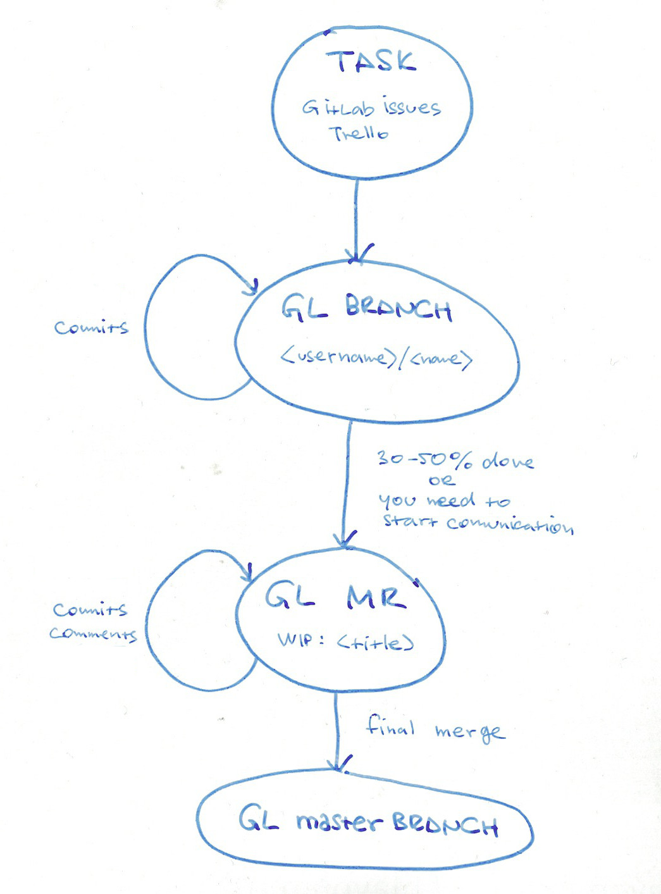
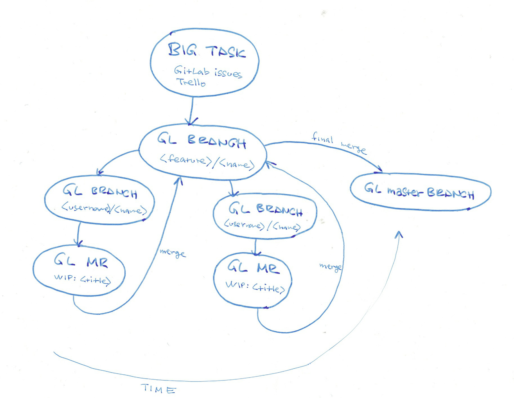
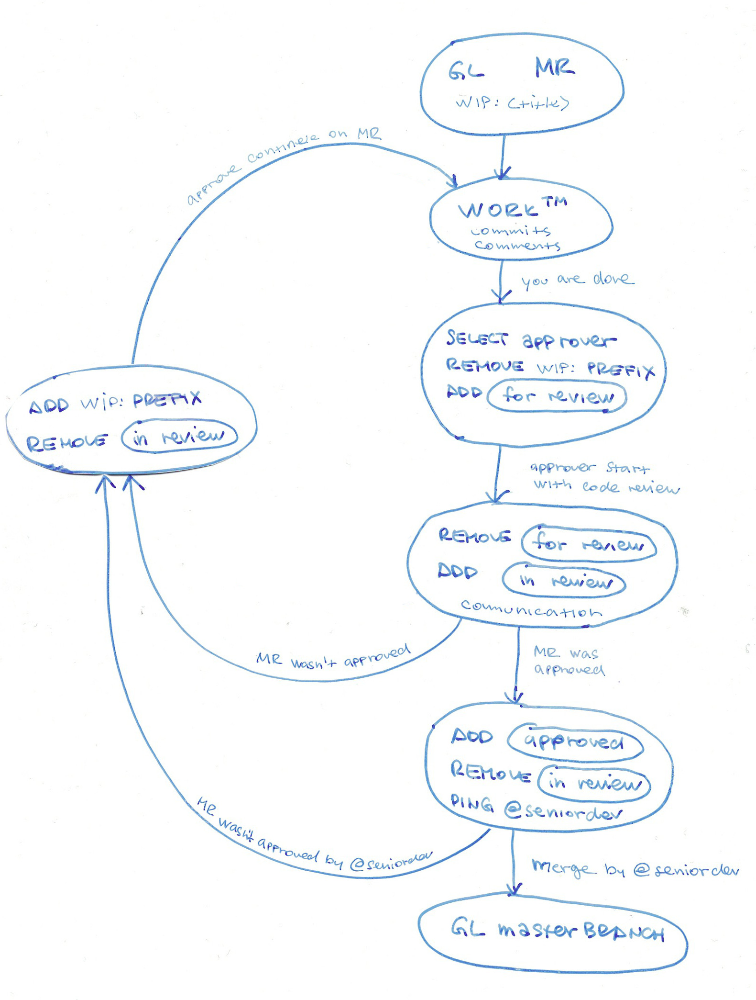

# Contributing guide

We are using [GitLab][1] for storing whole development cycle.

## Basic flow

* Tasks are described in [GitLab issues](https://gitlab.skypicker.com/django-team/kiwibase/issues)
  or [Trello board](https://trello.com/b/3JohoFi7/kiwi-django-development).
* For each task you will create new Git branch with name `<username>/<name>`, for example 
  `lukas/medical-check-permissions`.
* During development, keep your branch up to date with `master`. **Rebase 
  often**: `git rebase master`. Push your local changes **daily** to GitLab.
* Once you have roughly working solution, create *Merge request* (MR). Go to the
  [Branches section](https://gitlab.skypicker.com/django-team/kiwibase/branches), find you branch 
  and click on *Merge request* button. MR should be open when you have ~30-50% of work done, 
  not later.



* Bigger tasks should be split into several smaller MRs. Create one main branch like
  `feature/cafeteria` and every related MR starts from this branch (not `master`). Finished
  MR will be merged back to main feature branch (`feature/cafeteria`).



## Merge request

Every *Merge request* (MR) must be well described. Imagine yourself that you will 
be in future assigned to some MR with no context knowledge, and you should be 
able to make code review just from these informations.

* **Title**  
  Open your new MR with `WIP: ` prefix and some meaningful name.
* **Description**  
  In case that Title is not self explanatory, write 1-2 senteces about MR and add
  any relevant informations like referencies to Issues, Trello card, GDocs document, etc.
  Feel free to extend default checkbox list.
* **Asignee**  
  Select yourself as assignee. From this moment you will be responsible contact person for MR.
* **Milestone**  
  Each task should be related to one of our OKRs. If not (adhoc task, bugfixes), select "Other" 
  milestone.
* **Labels**  
  If appropriate, mark your MR with `importance/*` label.
* **Target branch**  
  Most of the time you will set it to `master`. In case of bigger tasks or special situations
  you could use another branch (see above in "Basic flow").

Once you create MR you should continue according to this picture:




* When you are done with your work, add *Approver* -- ideally from other team (kiwi.com vs 
  ShinyHouse), junior or senior based on issue complexity. Remove `WIP:` prefix from title, add 
  `for review` label. **Double check that you have updated `CHANGELOG` file please**.
* *Approver* will be notified by email about your MR. He should start with code in next 48 hours.
  Once he starts, he replaces `for review` label by `in review`. During code review
  process, people should communicate through comments in MR. In case bigger issues, 
  speak/Slack/Skype is more effective.
* In case approver find some issues, he removes `in review` label, adds `WIP: ` prefix into
  title and call upon assignee to continue on MR.
* If MR is OK, assignee replaces `in review` by `approved` label and pings `@seniordeveloper` in 
  final comment.
* According to difficult of task, `@seniordeveloper` could make final code review and 
  deny/approve merge of whole MR into master branch.

General notes:
  
* There shouldn't be more than 3 assigned MRs per person.
* We will try finish MR as soon as possible. If we found open MR older than
  14 days, it must be labeled as `importance/critical` and solved soon.

## Labels

• `importance/*` - differentiate issues/MRs by importance. Do tasks with higher importance first.   
• `difficulty/*` - differentiate issues/MRs by difficulty. Developers pick issues based on their level.  
• `dangerous-code` - code review should be done more thoroughly, or more people should do code review.  
• `waiting` - MR/Issue is waiting for somebody else/info/docs/...  
• `help wanted` - when you want others opinion and do not want to tag all developers.   
• `for review` - MR is ready for review.  
• `in review` - MRs with this tag are actively reviewed.  
• `approved` - MR was approved and can be merged. 

## Code reviews

We actively use code review process. Every change to codebase is published as
merge request and reviewed by some team member. There should not be single
authority for providing code reviews, reviewers should be selected within team
according to MR difficulty.

Few excerpts from Nina Zakharenko talk 
[*How to successfully grow a code review culture*][2]:

* The goal is to find bugs before out customers do. Case studies: lowering bug 
  rate by 80%, increased productivity by 15%
* Make commitment: **Always** Review before Merge
* Shared ownership == increased code quality (more eyes see more bugs). Code 
  should fit company's expectations and style. Great codebases are written 
  by a team, but look like they were written by an individual
* Shared knowledge == gained familiarity with different modules
* No blame culture: Failure is inevitable. Mistakes become team, not 
  individual responsibility
* Avoid burn-outs: Limit reviews to 200-400 lines between 60-90 minutes, then
  take break. Also try keep MR small as possible.
* Do reviews in 24-48 hours
* Define Done: Let the submitter know if you approve, or if they need to 
  make changes.
* Don’t be too clever. Readability Counts!
* Never push broken code into repository. You are the primary reviewer
* Don’t get too attached to your code before the review process. Anticipate 
  comments and feedback. Acknowledge you will make mistakes.

## Commit messages

Commit messages should meet following format:

```
tag: short message

long message
```

* `tag` is keyword, which characterize area in codebase you work on.
  Something like `export`, `promocodes`, `alerts`.
* `short message` is short description of commit. There is length
  limit on `tag` and `short message` -- together they should take up
  to 50 characters at max. Example: `Refactored handling of multiple field`.  
  You should be able to decode meaning of every commit from reading
  just `tag` and `short message`. Both of them are mandatory.
* `long message` is optional long description of commit. It is good
  idea to describe important changes in codebase in `long message`.
  There must be empty line betweem `short message` and `long message`

Commit messages must be written in English.

[1]: https://gitlab.skypicker.com/
[2]: http://www.slideshare.net/nnja/how-to-successfully-grow-a-code-review-culture
